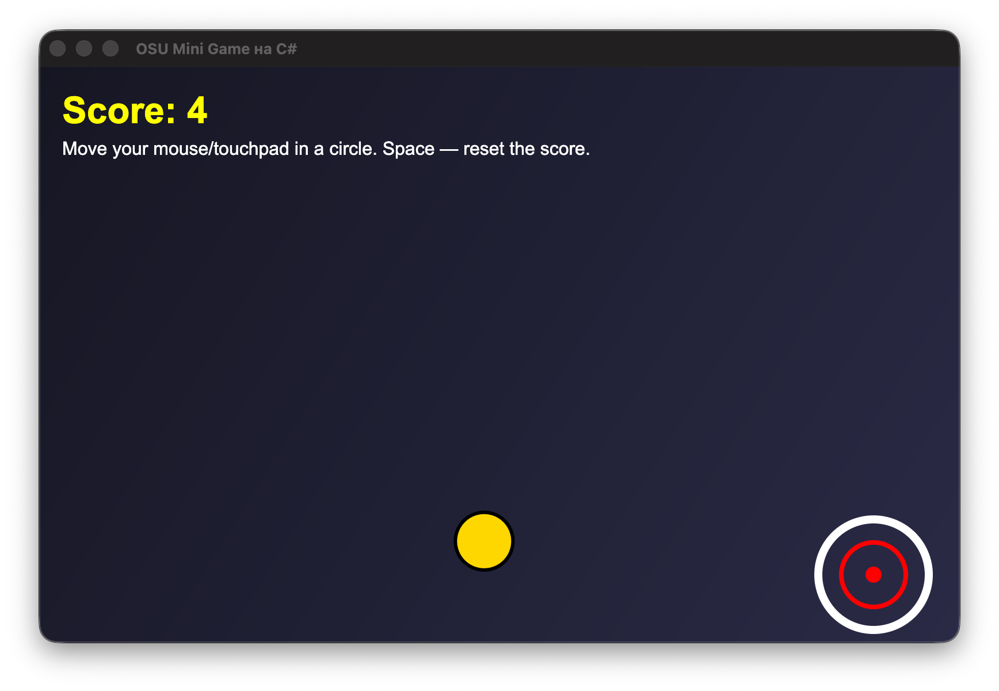

# OSU Mini Game in C#

## Description

OSU Mini Game is a C# minigame with a graphical interface built on Avalonia. 
The player controls the mouse or touchpad and must hit a moving target. 
Each hit awards a point.

## Feature

1. A moving target that bounces off the window borders.
2. Mouse or touchpad controls.
3. Real-time scoring.
4. Reset score with the Space key.
5. Adaptive window with minimal size.
6. Gradient background and rendering of game objects via Avalonia.
7. Cross-platform desktop interface.

## Installation and configuration

1. Clone repository

`git clone https://github.com/your-username/your-repository.git`

`cd your-repository`

2. Restore dependencies

`dotnet restore`

3. Run project

`dotnet run`

## Controls

- Move your mouse or touchpad in a circle.
- Hit the target with your cursor to score a point.
- Press Space to reset the score.

## Screenshots

## Technologies
- C#
- .NET 10
- Avalonia UI 11.3.7
- Avalonia.Desktop
- Avalonia.Themes.Fluent